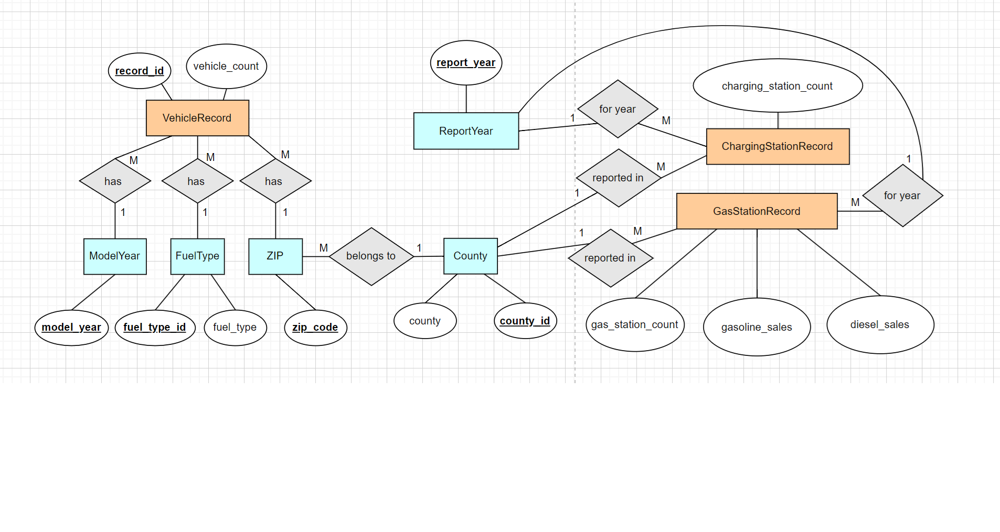
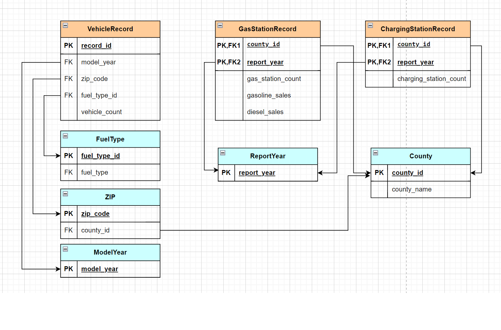
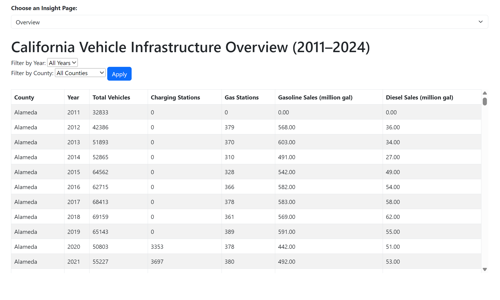
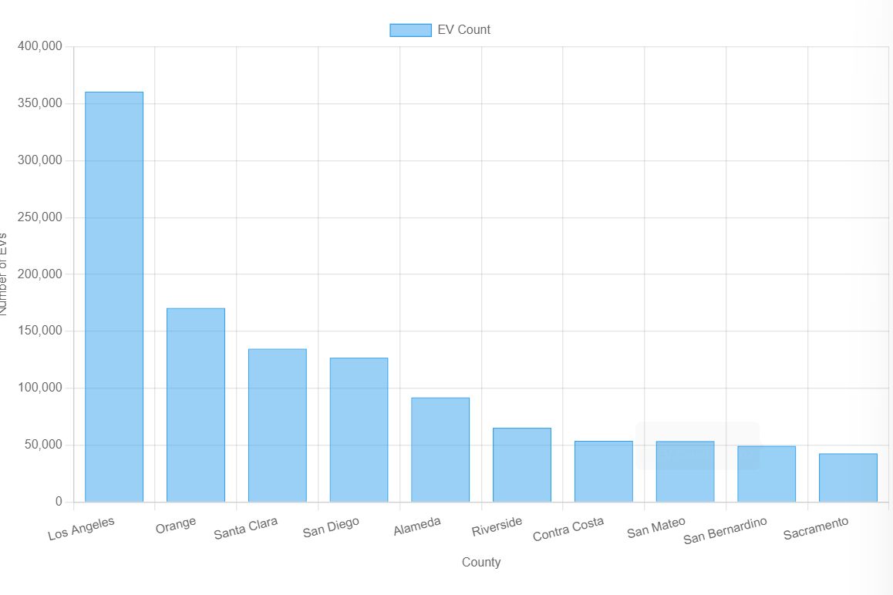
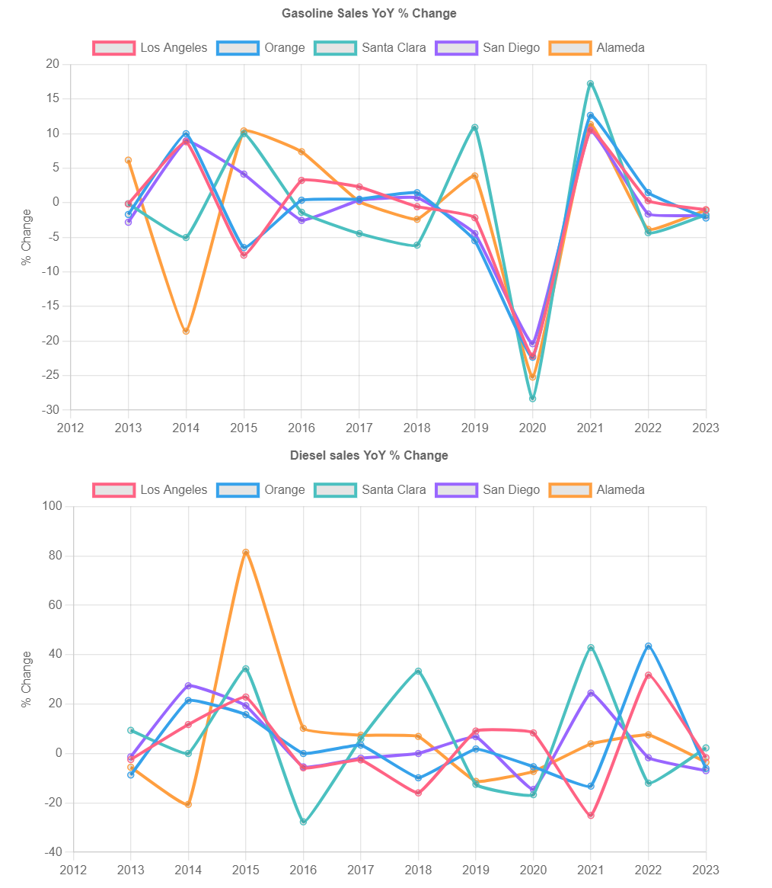
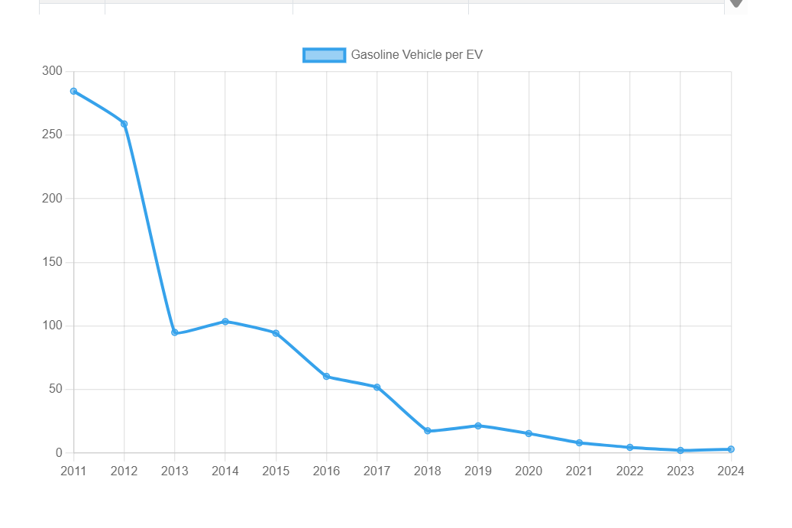
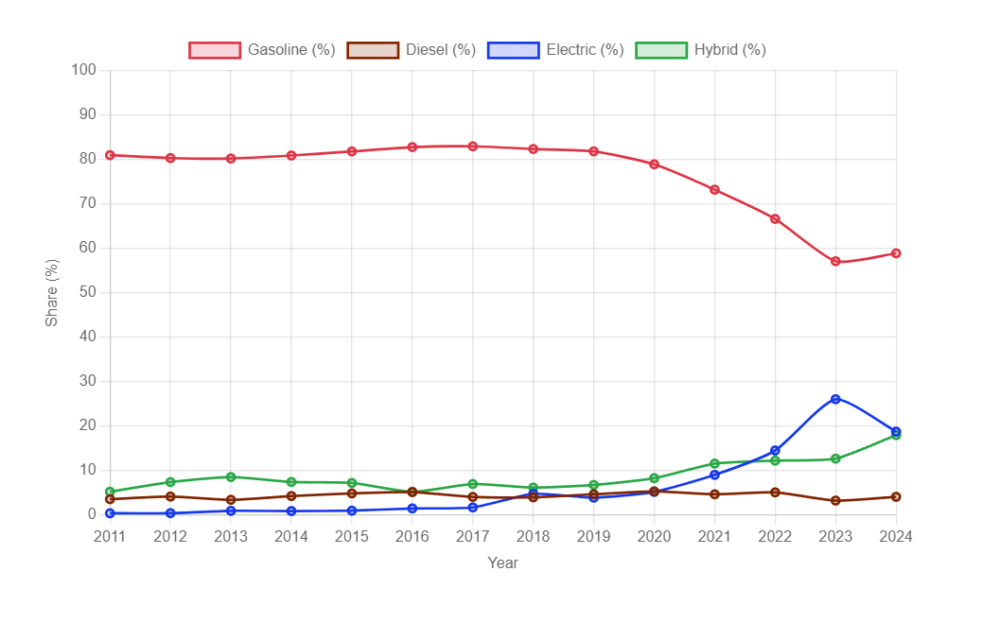
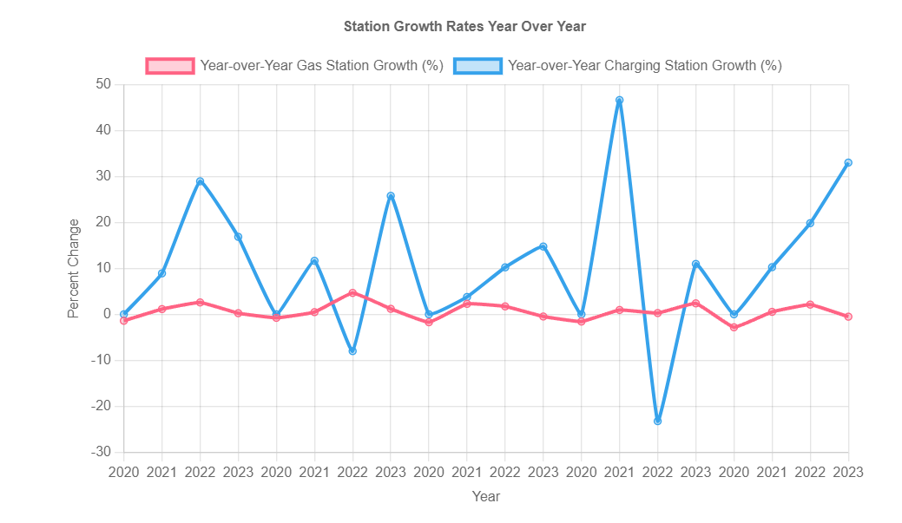

# EV Infrastructure Data Pipeline & Web Application

## Overview
This project builds an end-to-end data pipeline and web application to analyze the transition from gasoline vehicles to electric vehicles (EVs) in California.

It integrates multiple public datasets and provides an interactive dashboard to explore trends in vehicle adoption, fuel usage, and infrastructure development.

## Tech Stack
- Python (pandas) – data cleaning and transformation
- MySQL – database design and storage
- Node.js (Express) – backend services
- Mustache – server-side rendering
- Chart.js – data visualization

## Architecture
Raw Data → Data Cleaning (Pandas) → MySQL Database → Backend (Node.js) → Web Dashboard

## Data Pipeline

### Data Sources
- Vehicle registrations by ZIP and fuel type (CA DMV / data.ca.gov)
- Gas station counts and fuel sales by county (California Energy Commission)
- EV charging station counts (California Energy Commission)
- ZIP-to-county mapping (UnitedStatesZipCodes.org)

### Data Cleaning & Processing 
See full data cleaning process in [data_cleaning.ipynb](data_cleaning/data_cleaning.ipynb)
- Standardized inconsistent year formats  
- Removed invalid ZIP codes and unmatched records  
- Filtered aggregated or ambiguous data  
- Normalized text fields (fuel types, county names)  
- Exported cleaned datasets for database ingestion  

## Database Design

- Designed a normalized schema (3NF / BCNF)
- Implemented using a galaxy schema with fact and dimension tables
- Ensured data integrity and consistency across datasets
  

## Database Implementation

- Created schema using MySQL DDL
- Loaded data using `LOAD DATA INFILE`
- Maintained referential integrity through foreign keys

## Backend & Web Application

### Backend
- Built with Node.js and Express
- Connected to MySQL using mysql2
- Implemented query endpoints for analytics

### Security
- Created a read-only database user for safe data access

### Frontend
- Rendered views using Mustache templates
- Visualized data using Chart.js

## Features

- Interactive dashboard with filters (year, county)
- EV adoption ranking by county
- Gas vs EV ratio trends
- Fuel market share analysis
- Infrastructure growth (gas stations vs charging stations)
- Fuel sales trend analysis

## Dashboard 

### Dashboard Overview

### Counties with Most EVs

### Gasoline Vehicles to Electric Vehicles Ratio

### Market Share by Fuel Types

### Gas Station and Charging Station Movement

### Fossil Fuel Sales Analysis

## Key Insights

- EV adoption is rapidly increasing across California  
- Gas-to-EV ratio dropped significantly over time  
- Gasoline market share is declining while EV and hybrid rise  
- Charging infrastructure is expanding rapidly  
- Fuel sales show decline in high EV adoption regions  

## Notes

This project simulates a real-world data pipeline and analytics system, integrating data engineering, backend development, and visualization.

## Data Sources
- California DMV (vehicle registration data)
- California Energy Commission (fuel sales and charging stations)
- UnitedStatesZipCodes.org (ZIP-to-county mapping)
